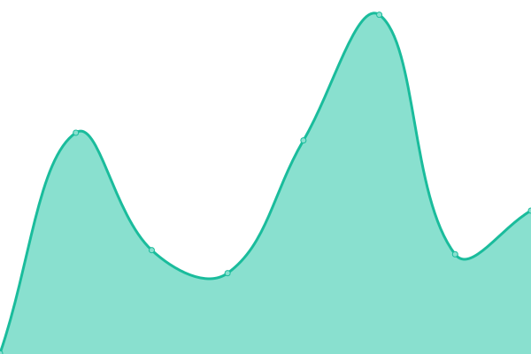

# [📈 Live Status](https://upptime.brianalabs.com): <!--live status--> **🟩 All systems operational**

This repository contains the open-source uptime monitor and status page for [Briana Labs](brianalabs.com), powered by [Upptime](https://github.com/upptime/upptime).

With [Upptime](https://upptime.js.org), you can get your own unlimited and free uptime monitor and status page, powered entirely by a GitHub repository. We use [Issues](https://github.com/brianalabs/upptime/issues) as incident reports, [Actions](https://github.com/brianalabs/upptime/actions) as uptime monitors, and [Pages](https://upptime.brianalabs.com) for the status page.

<!--start: status pages-->
<!-- This summary is generated by Upptime (https://github.com/upptime/upptime) -->
<!-- Do not edit this manually, your changes will be overwritten -->
<!-- prettier-ignore -->
| URL | Status | History | Response Time | Uptime |
| --- | ------ | ------- | ------------- | ------ |
|  [brianalabs.com](http://brianalabs.com) | 🟩 Up | [brianalabs-com.yml](https://github.com/brianalabs/upptime/commits/HEAD/history/brianalabs-com.yml) | 

 233ms
     
 | 

<a href="https://upptime.brianalabs.com/history/brianalabs-com">100.00%</a>
    

|  [api.brianalabs.com](https://api.brianalabs.com/v1/auth/me) | 🟩 Up | [api-brianalabs-com.yml](https://github.com/brianalabs/upptime/commits/HEAD/history/api-brianalabs-com.yml) | 

 670ms
     
 | 

<a href="https://upptime.brianalabs.com/history/api-brianalabs-com">100.00%</a>
    

|  [Upbit API](https://api.upbit.com/v1/market/all) | 🟩 Up | [upbit-api.yml](https://github.com/brianalabs/upptime/commits/HEAD/history/upbit-api.yml) | 

 1216ms
     
 | 

<a href="https://upptime.brianalabs.com/history/upbit-api">100.00%</a>
    

|  [Bithumb API](https://api.bithumb.com/public/ticker/all_krw) | 🟩 Up | [bithumb-api.yml](https://github.com/brianalabs/upptime/commits/HEAD/history/bithumb-api.yml) | 

 536ms
     
 | 

<a href="https://upptime.brianalabs.com/history/bithumb-api">100.00%</a>
    

|  [Coinone API](https://api.coinone.co.kr/ticker?currency=all) | 🟩 Up | [coinone-api.yml](https://github.com/brianalabs/upptime/commits/HEAD/history/coinone-api.yml) | 

 623ms
     
 | 

<a href="https://upptime.brianalabs.com/history/coinone-api">100.00%</a>
    

<!--end: status pages-->

[**Visit our status website →**](https://upptime.brianalabs.com)

## 📄 License

- Powered by: [Upptime](https://github.com/upptime/upptime)
- Code: [MIT](./LICENSE) © [Briana Labs](brianalabs.com)
- Data in the `./history` directory: [Open Database License](https://opendatacommons.org/licenses/odbl/1-0/)
